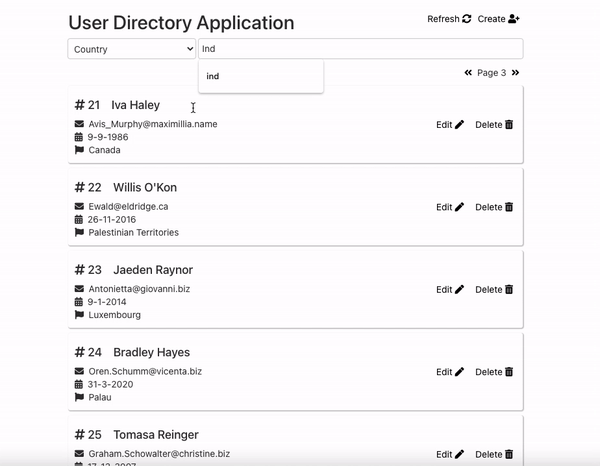

# user-directory-app
This is a React Application which maintains a user directory and uses the standard **fetch** api to perform CRUD operations on data served by a **json-server**. The application implements features like **pagination**, **search** and more. 



npm install -g json-server

# Usage

* Install Application Dependencies and jason-server
```
$ npm install
$ npm install -g json-server
```
* Start the json-server
```
$ json-server --watch test.json --port 3001 
```
* Start the application
```
$ npm start
```
* App should launch automatically on http://localhost:3000/
